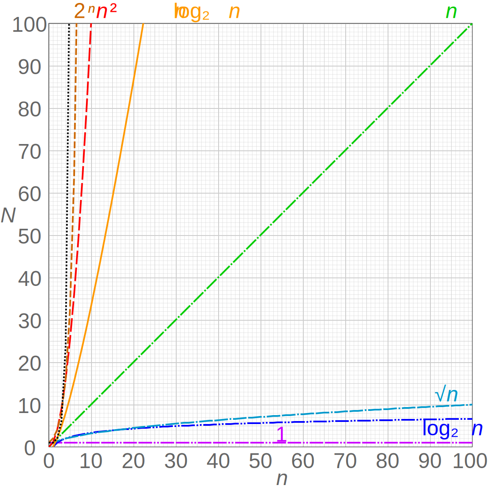

# 大O表示法 (Big O Notation)

大O表示法是计算机科学中用来描述算法复杂度的一种数学符号，用于描述算法的性能或资源需求如何随着输入规模的增长而增长。

## 简介

大O表示法关注的是算法在最坏情况下的表现，主要描述算法执行时间或占用空间随着输入数据量增加而增长的趋势。它不关心具体的执行时间，而是关心算法的扩展性。

> 此图作者 Cmglee - 自己的作品，CC BY-SA 4.0，https://commons.wikimedia.org/w/index.php?curid=50321072




## 常见的大O复杂度

### O(1) - 常数时间复杂度
无论输入数据量多大，执行时间都是固定的。
```js
function getFirstElement(arr) {
  return arr[0]; // 无论数组多大，都只取第一个元素
}
```

### O(log n) - 对数时间复杂度
随着输入数据量增加，执行时间按对数增长。常见于二分查找等算法。
```js
function binarySearch(arr, target) {
  let left = 0;
  let right = arr.length - 1;
  
  while (left <= right) {
    const mid = Math.floor((left + right) / 2);
    if (arr[mid] === target) return mid;
    if (arr[mid] < target) left = mid + 1;
    else right = mid - 1;
  }
  return -1;
}
```

### O(n) - 线性时间复杂度
执行时间与输入数据量成正比。
```js
function findMax(arr) {
  let max = arr[0];
  for (let i = 1; i < arr.length; i++) {
    if (arr[i] > max) max = arr[i];
  }
  return max;
}
```

### O(n log n) - 线性对数时间复杂度
常见于高效的排序算法，如快速排序、归并排序。
```js
// 归并排序示例
function mergeSort(arr) {
  if (arr.length <= 1) return arr;
  
  const mid = Math.floor(arr.length / 2);
  const left = mergeSort(arr.slice(0, mid));
  const right = mergeSort(arr.slice(mid));
  
  return merge(left, right);
}
```

### O(n²) - 平方时间复杂度
执行时间与输入数据量的平方成正比，常见于嵌套循环。
```js
function bubbleSort(arr) {
  const n = arr.length;
  for (let i = 0; i < n; i++) {
    for (let j = 0; j < n - i - 1; j++) {
      if (arr[j] > arr[j + 1]) {
        [arr[j], arr[j + 1]] = [arr[j + 1], arr[j]];
      }
    }
  }
  return arr;
}
```

### O(2ⁿ) - 指数时间复杂度
执行时间随着输入数据量呈指数增长，常见于递归求解斐波那契数列等问题。
```js
function fibonacci(n) {
  if (n <= 1) return n;
  return fibonacci(n - 1) + fibonacci(n - 2);
}
```

## 大O表示法的规则

### 1. 忽略常数项
O(2n) 简化为 O(n)，O(5) 简化为 O(1)

### 2. 忽略低阶项
O(n² + n) 简化为 O(n²)，O(n + log n) 简化为 O(n)

### 3. 只保留最高次项
在多项式中，只保留增长最快的项

## 时间复杂度与空间复杂度

### 时间复杂度
衡量算法执行时间随输入规模增长的变化趋势。

### 空间复杂度
衡量算法所需存储空间随输入规模增长的变化趋势，包括：
- 输入数据占用的空间
- 算法执行过程中额外开辟的空间

## 实际应用中的考虑

虽然大O表示法是分析算法效率的重要工具，但在实际应用中还需考虑：
- 常数因子的影响
- 数据规模的大小
- 硬件环境
- 算法的实现细节

## 相关资源

- [算法复杂度分析](https://zh.wikipedia.org/wiki/时间复杂度)
- [Big O Cheat Sheet](https://www.bigocheatsheet.com/)
