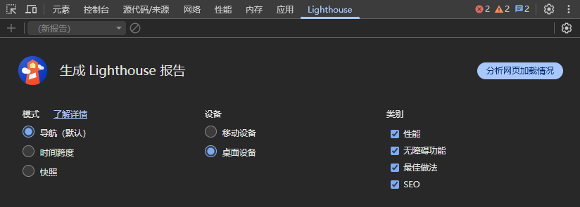

# Lighthouse

## 简介

`Lighthouse` 是 Google 开发的一个开源自动化工具，用于改进 Web 应用的质量。你可以将它作为一个 Chrome 扩展程序运行，也可以作为 Node.js 模块运行。你可以为 Lighthouse 提供一个需要审查的网址，它将针对该页面运行一连串的测试，然后生成一个有关页面性能、可访问性、 Progressive Web App (PWA)、SEO 等方面的报告。

## 特点

- **多维度审计**：提供性能、可访问性、最佳实践、SEO、PWA 五个维度的审计
- **自动化测试**：可以自动化运行，便于集成到 CI/CD 流程中
- **详细报告**：生成详细的审计报告，包含具体的问题描述和改进建议
- **可定制化**：支持自定义配置，可以选择需要审计的类别和权重
- **多种运行方式**：支持 Chrome DevTools、命令行、Node.js 模块等多种运行方式
- **开源免费**：完全开源，可以自由使用和扩展
- **持续集成支持**：可以轻松集成到持续集成流程中，监控网站质量

## 三种模式

- **导航模式**：**分析整个页面加载过程**的性能，适用于评估首次访问或完整重载时的体验。
- **时间跨度模式**：**分析用户交互（如点击、输入）后的性能**，适用于评估页面运行时的响应能力。
- **快照模式**：**分析当前页面状态的静态审计**，适用于评估可访问性、最佳实践等不依赖于加载过程的指标。

## 使用

完成分析后，Lighthouse 会生成一份详细的报告，其中包含网站在各个评估维度的得分情况，并明确指出网站存在的问题和优化建议。

> 注意：如果要分析桌面设备，将浏览器开发者工具分离为一个单独窗口，以免影响窗口大小。

### 指标

- **First Contentful Paint （FCP）**: 衡量用户看到**首次内容**出现所需的时间。
- **Largest Contentful Paint （LCP）**: 衡量用户看到**最大、最主要内容**渲染完成的时间。
- **Total Blocking Time （TBT）**: 衡量页面在可交互之前，主线程被**任务阻塞**的总时长，直接影响交互响应速度。
- **Cumulative Layout Shift （CLS）**: 衡量页面因元素意外移动而导致的**视觉稳定性**分数。
- **Speed Index （SI）**: 衡量页面内容在视觉上**填充完成**的平均速度。

## 历史

`Lighthouse` 的发展历程如下：

- **2016年**：Google 首次发布 Lighthouse 项目，作为 Chrome DevTools 的一部分
- **2017年**：Lighthouse 成为 PageSpeed Insights 的底层技术
- **2018年**：发布 Lighthouse 3.0，改进了性能审计和报告格式
- **2019年**：集成到 Chrome DevTools 中，成为内置工具
- **2020年**：发布 Lighthouse 6.0，增加新的审计项和改进评分算法

Lighthouse 的出现为 Web 开发者提供了一个标准化的网站质量评估工具，帮助开发者构建更好的 Web 应用。

## 相关链接

- [Lighthouse 官网](https://developer.chrome.com/docs/lighthouse/overview?hl=zh-cn)
- [Lighthouse GitHub 仓库](https://github.com/GoogleChrome/lighthouse)
- [Chrome DevTools 文档](https://developers.google.com/web/tools/chrome-devtools)
- [Lighthouse CI](https://github.com/GoogleChrome/lighthouse-ci)
- [What Is SEO – Search Engine Optimization?](https://searchengineland.com/guide/what-is-seo)
- [web.dev](https://web.dev/?hl=zh-cn)
