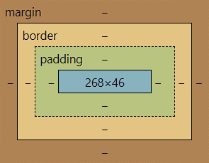
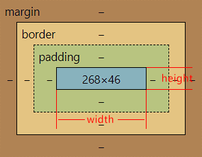
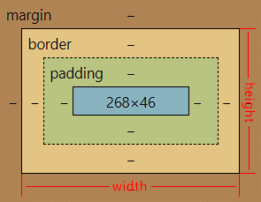

# 盒子模型

CSS（层叠样式表）盒模型是用于布局网页元素的基本概念之一。每个 HTML 元素被看作一个矩形的盒子，这个盒子包含内容、内边距、边框和外边距。这些组成部分共同构成了所谓的 CSS 盒模型。盒模型分为两种标准：W3C 标准盒模型和 IE（Internet Explorer）盒模型。



盒模型的属性包括：

-   **内容框（content box）：** 包含实际的内容，比如文本、图像等。
-   **内边距（padding）：** 紧跟在内容框周围，透明区域，可以用来设置元素内容与边框之间的空间。
-   **边框（border）：** 紧跟在内边距周围，包裹内容框，用于设置元素的边框样式、颜色和宽度。
-   **外边距（margin）：** 紧跟在边框周围，透明区域，用于设置元素与其他元素之间的空间。

盒模型的总宽度计算公式为：
$\text{总宽度} = \text{内容框宽度} + \text{左内边距} + \text{左边框宽度} + \text{左外边距} + \text{右内边距} + \text{右边框宽度} + \text{右外边距}$

## W3C 标准盒模型

在标准盒模型中，width 指内容框的宽度，height 亦是指内容框的高度。



## IE 盒模型（怪异盒模型）

在 IE 盒模型中 width 则是值
$\text{左边框宽度} + \text{左内边距} + \text{内容框宽度} + \text{右内边距} + \text{右边框宽度}$
<br />height 则指<br />
$\text{上边框宽度} + \text{上内边距} + \text{内容框高度} + \text{下内边距} + \text{下边框宽度}$



## 两个盒模型的区别

W3C 标准盒模型和 IE 盒模型是两种不同的盒模型，用于描述网页中元素的尺寸计算方式。它们之间的主要区别在于如何计算元素的宽度和高度，以及边框、内边距和内容之间的关系。

-   W3C 标准盒模型
    -   在标准盒模型中，一个元素的总宽度和高度包括了内容区域、内边距和边框。
    -   元素的宽度和高度计算方式为：width/height = 内容区域的宽度/高度 + 内边距 + 边框。
    -   即，元素的宽度和高度不包括边框和内边距。
-   IE 盒模型
    -   在早期的 Internet Explorer（IE）中，盒模型是以包含边框和内边距的内容区域来计算宽度和高度的。
    -   元素的宽度和高度计算方式为：width/height = 内容区域的宽度/高度，而边框和内边距会被包含在宽度和高度中。
    -   这导致了在使用旧版本的 IE 中设置宽度和高度时，实际的渲染尺寸可能与预期不符。

```css
.box {
	width: 100px;
	height: 100px;
	padding: 10px;
	border: 5px solid black;
	margin: 10px;
}
```

对于上述样式，元素实际宽度为：

-   W3C 标准盒模型：100px（内容区域） + 2 \* 10px（左右内边距） + 2 \* 5px（左右边框） + 2 \* 10px（左右外边距） = 150px。
-   IE 盒模型：70px（内容区域） + 2 \* 10px（左右内边距） + 2 \* 5px（左右边框） + 2 \* 10px（左右外边距） = 120px。

    因为 IE 盒模型宽度/高度是包含边框和内边距，所以内容区域被压缩了 30px。

## 设置盒模型

默认情况下，大多数浏览器采用 W3C 标准盒模型，但可以通过 CSS 的`box-sizing`属性来设置使用哪种盒模型。例如：

```css
/* 使用W3C标准盒模型 */
box-sizing: content-box;

/* 使用IE盒模型 */
box-sizing: border-box;
```

在实际开发中，通常建议使用 W3C 标准盒模型，因为它更符合直觉，特别是在计算元素的宽度和高度时。但在某些情况下，比如不想让边框和内边距影响宽高时，使用 IE 盒模型显然更合适。

## padding 内边距

```css
p {
	/* 一个值：上下左右的内边距 */
	padding: 10px;
	/* 两个值：上下的内边距，左右的内边距 */
	padding: 10px 10px;
	/* 三个值：上内边距，左右的内边距，下内边距 */
	padding: 10px 10px 10px;
	/* 四个值：上内边距，右内边距，下内边距，左内边距 */
	padding: 10px 10px 10px 10px;

	/* 上内边距 */
	padding-top: 10px;
	/* 右内边距 */
	padding-right: 10px;
	/* 下内边距 */
	padding-bottom: 10px;
	/* 左内边距 */
	padding-left: 10px;
}
```

## border 边框

## margin 外边距

```css
p {
	/* 一个值：上下左右的外边距 */
	margin: 10px;
	/* 两个值：上下的外边距，左右的外边距 */
	margin: 10px 10px;
	/* 三个值：上外边距，左右的外边距，下外边距 */
	margin: 10px 10px 10px;
	/* 四个值：上外边距，右外边距，下外边距，左外边距 */
	margin: 10px 10px 10px 10px;

	/* 上外边距 */
	margin-top: 10px;
	/* 右外边距 */
	margin-right: 10px;
	/* 下外边距 */
	margin-bottom: 10px;
	/* 左外边距 */
	margin-left: 10px;
}
```

## 外边距合并

外边距合并是指在垂直方向上相邻的两个块级元素的上边距（margin-top）和下边距（margin-bottom）可能会合并成一个较大的外边距。外边距合并规则主要适用于垂直方向上相邻的块级框。

上下元素相邻时，上下元素的外边距会合并为一个外边距。合并后的外边距的高度等于两个发生合并的外边距的高度中的较大者。


当一个元素包含在另一个元素中时，且外面的元素没有用内边距或边框把外边距和里面那个元素的外边距隔开，它们的上或下外边距也会发生合并。


尽管看上去有些奇怪，但是外边距甚至可以与自身发生合并。假设有一个空元素，它有外边距，但是没有边框或填充。在这种情况下，上外边距与下外边距就碰到了一起，它们会发生合并。


如果这个外边距遇到另一个元素的外边距，它还会发生合并。


在列表结构中，有了外边距合并这一特性，控制列表项之间的间距就很容易了。


