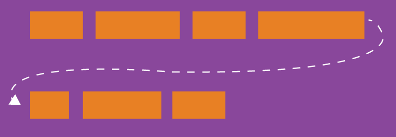
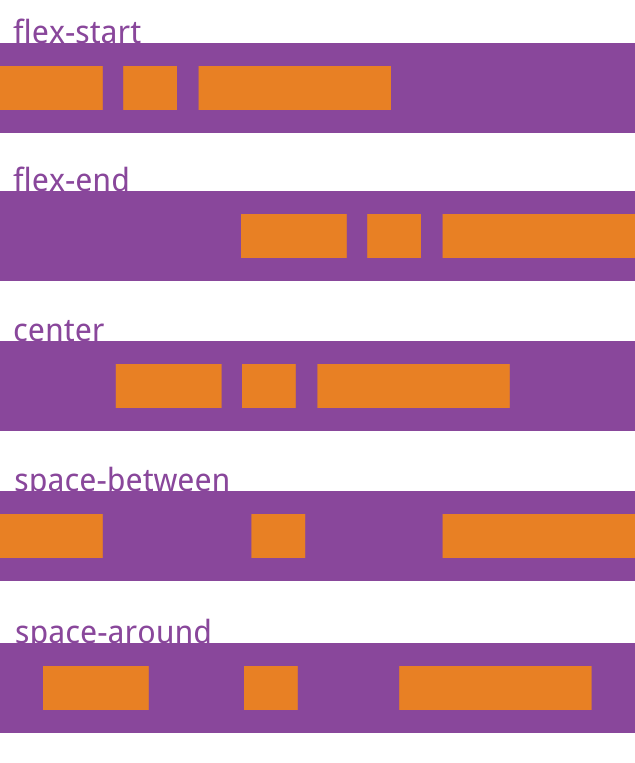
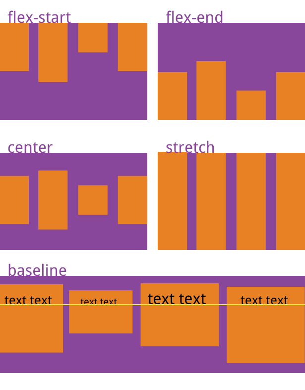
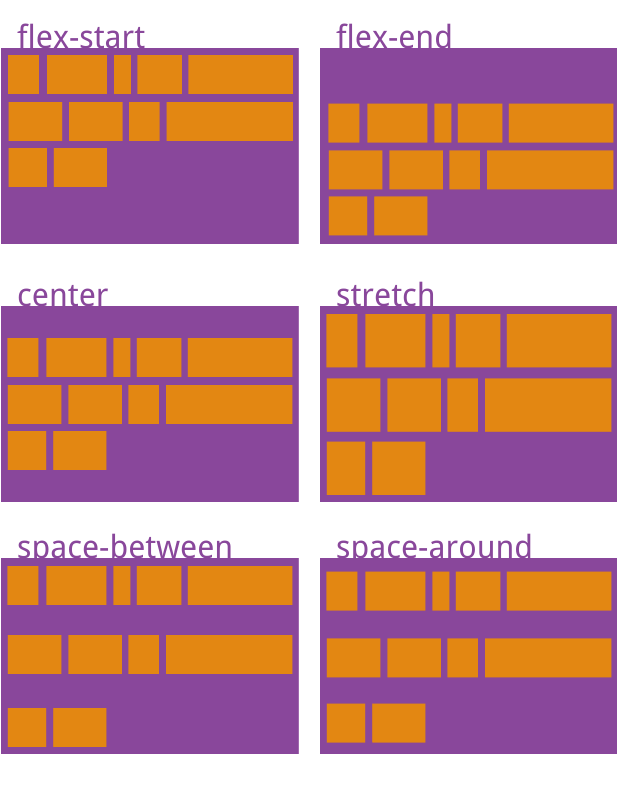
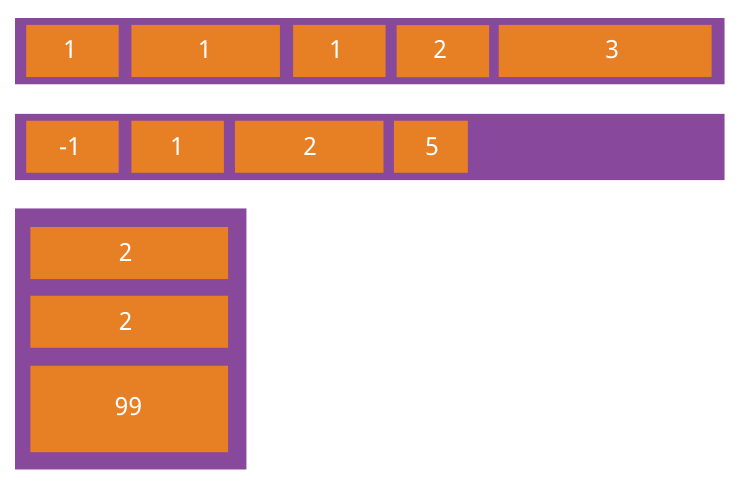

<script setup>
import FlexDirectionDemo from './components/flex-direction-demo.vue'
import FlexWrapDemo from './components/flex-wrap-demo.vue'
import JustifyContentDemo from './components/justify-content-demo.vue'
import AlignItemsDemo from './components/align-items-demo.vue'
import Flex1Demo from './components/flex1-demo.vue'
import AlignSelfDemo from './components/align-self-demo.vue'
</script>

# 弹性布局 flex

Flex 是 Flexible Box 的缩写，意为 "**弹性布局**"，用来为盒状模型提供最大的灵活性。

任何一个容器都可以指定为 Flex 布局。

```css
.box {
	display: flex;
}
```

行内元素也可以使用 Flex 布局。

```css
.box {
	display: inline-flex;
}
```

::: warning
注意，设为 Flex 布局以后，子元素的 `float`、`clear` 和 `vertical-align` 属性将失效。
:::

## 基本概念

采用 Flex 布局的元素，称为 Flex 容器（flex container），简称"容器"。它的所有子元素自动成为容器成员，称为 Flex 项目（flex item），简称"项目"。


容器默认存在两根轴：水平的主轴（**main axis**）和垂直的交叉轴（**cross axis**）。主轴的开始位置（与边框的交叉点）叫做 **main start**，结束位置叫做 **main end**；交叉轴的开始位置叫做 **cross start**，结束位置叫做 **cross end**。

项目默认沿主轴排列。单个项目占据的主轴空间叫做 main size，占据的交叉轴空间叫做 cross size。

## 容器属性

以下 6 个属性设置在容器上。

-   `flex-direction`
-   `flex-wrap`
-   `flex-flow`
-   `justify-content`
-   `align-items`
-   `align-content`

### flex-direction 主轴方向

`flex-direction` 属性决定主轴的方向（即项目的排列方向）。

```css
.box {
	flex-direction: row;
	flex-direction: row-reverse;
	flex-direction: column;
	flex-direction: column-reverse;
}
```


取值：

-   `row`（默认值）：主轴为水平方向，起点在左端。
-   `row-reverse`：主轴为水平方向，起点在右端。
-   `column`：主轴为垂直方向，起点在上沿。
-   `column-reverse`：主轴为垂直方向，起点在下沿。

<FlexDirectionDemo />

### flex-wrap 换行

默认情况下，项目都排在一条线（又称"轴线"）上。`flex-wrap` 属性定义，如果一条轴线排不下，如何换行。



```css
.box {
	flex-wrap: nowrap;
	flex-wrap: wrap;
	flex-wrap: wrap-reverse;
}
```

取值：

-   `nowrap`（默认）：不换行。
    

-   `wrap`：换行，第一行在上方。
    

-   `wrap-reverse`：换行，第一行在下方。
    

<FlexWrapDemo />

### flex-flow

`flex-flow` 属性是 `flex-direction` 属性和 `flex-wrap` 属性的简写形式，默认值为 `row nowrap`。

```css
.box {
	flex-flow: <flex-direction> || <flex-wrap>;
}
```

### justify-content 主轴对齐

`justify-content` 属性定义了项目在主轴上的对齐方式。

```css
.box {
	justify-content: flex-start;
	justify-content: flex-end;
	justify-content: center;
	justify-content: space-between;
	justify-content: space-around;
}
```



取值：

-   `flex-start`（默认值）：左对齐
-   `flex-end`：右对齐
-   `center`： 居中
-   `space-between`：两端对齐，项目之间的间隔都相等。
-   `space-around`：每个项目两侧的间隔相等。所以，项目之间的间隔比项目与边框的间隔大一倍。

<JustifyContentDemo />

### align-items 交叉轴对齐

`align-items` 属性定义项目在交叉轴上如何对齐。

```css
.box {
	align-items: flex-start;
	align-items: flex-end;
	align-items: center;
	align-items: baseline;
	align-items: stretch;
}
```



取值：

-   `flex-start`：交叉轴的起点对齐。
-   `flex-end`：交叉轴的终点对齐。
-   `center`：交叉轴的中点对齐。
-   `baseline`: 项目的第一行文字的基线对齐。
-   `stretch`（默认值）：如果项目未设置高度或设为 auto，将占满整个容器的高度（如果项目设置了 `height` 那么 `stretch` 就会失效）。

<AlignItemsDemo />

### align-content 多交叉轴对齐

`align-content` 属性定义了多根轴线的对齐方式。如果项目只有一根轴线，该属性不起作用。

```css
.box {
	align-content: flex-start;
	align-content: flex-end;
	align-content: center;
	align-content: space-between;
	align-content: space-around;
	align-content: stretch;
}
```



取值：

-   `flex-start`：与交叉轴的起点对齐。
-   `flex-end`：与交叉轴的终点对齐。
-   `center`：与交叉轴的中点对齐。
-   `space-between`：与交叉轴两端对齐，轴线之间的间隔平均分布。
-   `space-around`：每根轴线两侧的间隔都相等。所以，轴线之间的间隔比轴线与边框的间隔大一倍。
-   `stretch`（默认值）：轴线占满整个交叉轴。

## 项目属性

以下 6 个属性可以设置在项目上。

-   `order`
-   `flex-grow`
-   `flex-shrink`
-   `flex-basis`
-   `flex`
-   `align-self`

### order 顺序

`order` 属性定义项目的排列顺序。数值越小，排列越靠前，默认为 `0`。

```css
.item {
	order: <integer>;
}
```



### flex-grow 放大比例

`flex-grow` 属性定义项目的放大比例，默认为 `0`，即如果存在剩余空间，也不放大。

```css
.item {
	flex-grow: <number>; /* default 0 */
}
```


如果所有项目的 `flex-grow` 属性都为 `1`，则它们将等分剩余空间（如果有的话）。如果一个项目的 `flex-grow` 属性为 `2`，其他项目都为 `1`，则前者占据的剩余空间将比其他项多一倍。

### flex-shrink 缩小比例

`flex-shrink` 属性定义了项目的缩小比例，默认为 `1`，即如果空间不足，该项目将缩小。

```css
.item {
	flex-shrink: <number>; /* default 1 */
}
```


如果所有项目的 `flex-shrink` 属性都为 `1`，当空间不足时，都将等比例缩小。如果一个项目的 `flex-shrink` 属性为 `0`，其他项目都为 `1`，则空间不足时，前者不缩小。

负值对该属性无效。

### flex-basis

`flex-basis` 属性定义了在分配多余空间之前，项目占据的主轴空间（main size）。浏览器根据这个属性，计算主轴是否有多余空间。它的默认值为 `auto`，即项目的本来大小。

```css
.item {
	flex-basis: <length> | auto; /* default auto */
}
```

它可以设为跟 `width` 或 `height` 属性一样的值（比如 `350px`），则项目将占据固定空间。

### flex

`flex` 属性是 `flex-grow`, `flex-shrink` 和 `flex-basis` 的简写，默认值为 `0 1 auto`。后两个属性可选。

<!-- prettier-ignore -->
```css
.item {
	flex: none | [ <'flex-grow'> <'flex-shrink'>? || <'flex-basis'> ];
}
```

该属性有两个快捷值：`auto` (`1 1 auto`) 和 `none` (`0 0 auto`)。

建议优先使用这个属性，而不是单独写三个分离的属性，因为浏览器会推算相关值。

使用 `flex: 1;` 可以很简单的实现撑满剩下的空间。

<Flex1Demo />

### align-self

`align-self` 属性允许单个项目有与其他项目不一样的对齐方式，可覆盖 `align-items` 属性。默认值为 `auto`，表示继承父元素的 `align-items` 属性，如果没有父元素，则等同于 `stretch`。

```css
.item {
	align-self: auto;
	align-self: flex-start;
	align-self: flex-end;
	align-self: center;
	align-self: baseline;
	align-self: stretch;
}
```


该属性可能取 6 个值，除了 `auto`，其他都与 `align-items` 属性完全一致。

同样，如果项目设置了 `height` 那么 `stretch` 就会失效。

<AlignSelfDemo />

[参考: Flex 布局教程：语法篇 - 阮一峰的网络日志](https://www.ruanyifeng.com/blog/2015/07/flex-grammar.html)

[旧的](/css/layout/old-flex)
