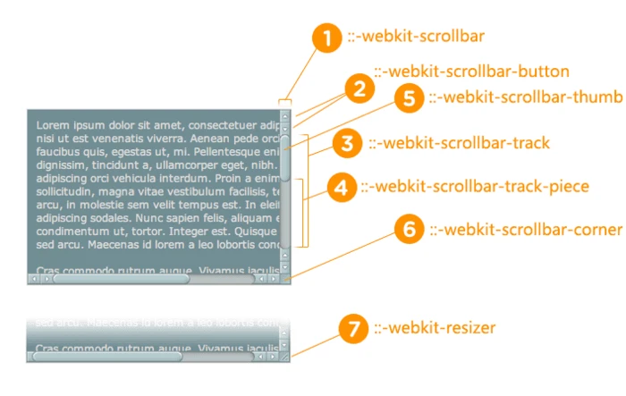

# 溢出处理与滚动样式

## 溢出处理

### overflow

`overflow` 是一个简写属性，用于设置当内容在水平和/或垂直方向上不适应父元素框（溢出）时的行为。

<script setup>
import OverflowDemo from './components/overflow-demo.vue'
import OverflowWrapDemo from './components/overflow-wrap-demo.vue'
import OverflowClipMarginDemo from './components/overflow-clip-margin-demo.vue'
</script>

<OverflowDemo />

```css
div {
	/* 双值 x 和 y 一起设置 */
	overflow: visible;
	overflow: hidden;
	overflow: clip;
	overflow: scroll;
	overflow: auto;
	/* 双值 x y */
	overflow: hidden visible;
}
```

### overflow-block

`overflow-block` 属性用于设置当内容溢出盒的块首和块末侧时所显示的内容。可以不显示，或者显示滚动条或溢出内容。

```css
div {
	overflow-block: visible; /* 溢出显示 */
	overflow-block: hidden; /* 溢出隐藏 */
	overflow-block: clip; /* 溢出裁剪 */
	overflow-block: scroll; /* 溢出显示滚动条 */
	overflow-block: auto; /* 内容溢出时为 scroll 没有溢出时为 visible*/
}
```

取值:

-   `visible`: 不裁剪内容且可在内边距盒的块首和块末侧外渲染内容。

-   `hidden`: 若内边距盒在块向尺度上无法容纳内容则裁剪内容。不提供滚动条。

-   `clip`: 溢出内容在元素的溢出边缘进行裁剪，该边缘是使用 `overflow-clip-margin` 属性定义的。

-   `scroll`: 若内边距盒在块向尺度上无法容纳内容则裁剪内容。无论内容是否被裁剪，浏览器均显示滚动条。（由此可阻止滚动条在内容变化时显示或消失。）打印机仍可能打印溢出内容。

-   `auto`: 取决于用户代理。若内边距盒可以容纳内容，则与 visible 表现相同，但仍建立新的块格式化上下文。若内容溢出则桌面浏览器提供滚动条。

### overflow-anchor

`overflow-anchor` 属性提供一种退出浏览器滚动锚定行为的方法，该行为会调整滚动位置以最大程度地减少内容偏移。

默认情况下，在任何支持滚动锚定行为的浏览器中都将其启用。因此，仅当你在文档或文档的一部分中遇到滚动锚定问题并且需要关闭行为时，才通常需要更改此属性的值。

```css
div {
	overflow-anchor: auto;
	overflow-anchor: none;
}
```

取值：

-   `auto`: 该元素在调整滚动位置时变为潜在锚点。

-   `none`: 该元素不会被选择为潜在锚点。

### overflow-inline

`overflow-inline` 属性用于设置当内容溢出盒的行首和行末侧时所显示的内容。可以不显示，或者显示滚动条或溢出内容。

```css
div {
	overflow-inline: visible;
	overflow-inline: hidden;
	overflow-inline: scroll;
	overflow-inline: auto;
}
```

取值:

-   `visible`: 不裁剪内容且可在内边距盒的行首和行末侧外渲染内容。

-   `hidden`: 若内边距盒在行向尺度上无法容纳内容则裁剪内容。不提供滚动条。

-   `scroll`: 若内边距盒在行向尺度上无法容纳内容则裁剪内容。无论内容是否被裁剪，浏览器均显示滚动条。（由此可阻止滚动条在内容变化时显示或消失。）打印机仍可能打印溢出内容。

-   `auto`: 取决于用户代理。若内边距盒可以容纳内容，则与 visible 表现相同，但仍建立新的块格式化上下文。若内容溢出则桌面浏览器提供滚动条。

### overflow-wrap

`overflow-wrap` 属性应用于行级元素，用来设置浏览器是否应该在一个本来不能断开的字符串中插入换行符，以防止文本溢出其行向盒。

<OverflowWrapDemo />

这个属性原本属于微软扩展的一个非标准、无前缀的属性，叫做 `word-wrap`，后来在大多数浏览器中以相同的名称实现。目前它已被更名为` overflow-wrap`，`word-wrap` 相当于其别称。

```css
div {
	overflow-wrap: normal;
	overflow-wrap: break-word;
	overflow-wrap: anywhere;
}
```

取值：

-   `normal`: 行只能在正常的单词断点（例如两个单词之间的空格）处换行。

-   `anywhere`: 为防止溢出，如果行中没有其他可接受的断点，则不可断的字符串（如长词或 URL）可能会在任何时候换行。在断点处不会插入连字符。在计算最小内容内在大小时，会考虑由单词换行引入的软换行机会。

-   `break-word`: 与 `anywhere` 值相同，如果行中没有其他可接受的断点，则允许在任意点将通常不可断的单词换行，但在计算最小内容内在大小时不考虑断字引入的软换行机会。

### overflow-clip-margin

`overflow-clip-margin` 属性用于控制元素的溢出内容的显示方式。该属性决定了一个元素在具有 `overflow: clip;` 属性时，可以绘制到其边界外部的距离，超过这个距离就会被剪切掉。

<OverflowClipMarginDemo />

```css
div {
	border: 3px solid;
	width: 250px;
	height: 100px;
	overflow: clip;
	overflow-clip-margin: 10px;

	/* 负数无用 */
	overflow-clip-margin: -10px;
}
```

### overflow-x

`overflow-x` 属性用于控制元素在水平（x）方向上的溢出行为。

```css
div {
	overflow-x: visible;
	overflow-x: hidden;
	overflow-x: clip;
	overflow-x: scroll;
	overflow-x: auto;
}
```

### overflow-y

`overflow-y` 属性用于控制元素在垂直（y）方向上的溢出行为。

```css
div {
	overflow-y: visible;
	overflow-y: hidden;
	overflow-y: clip;
	overflow-y: scroll;
	overflow-y: auto;
}
```

## 滚动样式



属性介绍：

```css
/* 滚动条整体部分 */
::-webkit-scrollbar {
}
/* 滚动条两端的按钮 */
::-webkit-scrollbar-button {
}
/* 外层轨道 */
::-webkit-scrollbar-track {
}
/* 内层轨道，滚动条中间部分（除去） */
::-webkit-scrollbar-track-piece {
}
/* 滚动条里面可以拖动的那个 */
::-webkit-scrollbar-thumb {
}
/* 边角 */
::-webkit-scrollbar-corner {
}
/* 定义右下角拖动块的样式 */
::-webkit-resizer {
}
```

```css
/*定义滚动条高宽及背景
 高宽分别对应横竖滚动条的尺寸*/
::-webkit-scrollbar {
	width: 16px;
	height: 16px;
	background-color: #f5f5f5;
}
/*定义滚动条轨道
 内阴影+圆角*/
::-webkit-scrollbar-track {
	-webkit-box-shadow: inset 0 0 6px rgba(0, 0, 0, 0.3);
	border-radius: 10px;
	background-color: #f5f5f5;
}
/*定义滑块
 内阴影+圆角*/
::-webkit-scrollbar-thumb {
	border-radius: 10px;
	-webkit-box-shadow: inset 0 0 6px rgba(0, 0, 0, 0.3);
	background-color: #555;
}
```
