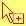

# 鼠标样式

```css
p {
	cursor: pointer;
}
```

通过设置 `cursor` 属性，可以改变鼠标指针的样式。

以下是 `cursor` 属性的取值 ([参考](https://developer.mozilla.org/zh-CN/docs/Web/CSS/cursor))：

<table data-no-zoom>
	<thead>
		<tr>
			<th>类型</th>
			<th>CSS 值</th>
			<th>例子</th>
			<th>描述</th>
		</tr>
	</thead>
	<tbody>
		<tr style="cursor: auto">
			<td rowspan="3">General</td>
			<td><code>auto</code></td>
			<td></td>
			<td>
				<p>浏览器根据当前内容决定指针样式<br />例如当内容是文字时使用 text 样式</p>
			</td>
		</tr>
		<tr style="cursor: default">
			<td><code>default</code></td>
			<td>
				
			</td>
			<td>默认指针，通常是箭头。</td>
		</tr>
		<tr style="cursor: none">
			<td><code>none</code></td>
			<td></td>
			<td>无指针被渲染</td>
		</tr>
		<tr style="cursor: context-menu">
			<td rowspan="5" style="cursor: auto">链接及状态</td>
			<td><code>context-menu</code></td>
			<td>
				
			</td>
			<td>指针下有可用内容目录。</td>
		</tr>
		<tr style="cursor: help">
			<td><code>help</code></td>
			<td>
				
			</td>
			<td>指示帮助</td>
		</tr>
		<tr style="cursor: pointer">
			<td><code>pointer</code></td>
			<td>
				
			</td>
			<td>悬浮于连接上时，通常为手</td>
		</tr>
		<tr style="cursor: progress">
			<td><code>progress</code></td>
			<td>
				
			</td>
			<td>程序后台繁忙，用户仍可交互 (与<code>wait 相反</code>).</td>
		</tr>
		<tr style="cursor: wait">
			<td><code>wait</code></td>
			<td>
				
			</td>
			<td>程序繁忙，用户不可交互 (与<code>progress 相反</code>).图标一般为沙漏或者表。</td>
		</tr>
		<tr style="cursor: cell">
			<td rowspan="4" style="cursor: auto">选择</td>
			<td><code>cell</code></td>
			<td>
				
			</td>
			<td>指示单元格可被选中</td>
		</tr>
		<tr style="cursor: crosshair">
			<td><code>crosshair</code></td>
			<td>
				
			</td>
			<td>交叉指针，通常指示位图中的框选</td>
		</tr>
		<tr style="cursor: text">
			<td><code>text</code></td>
			<td>
				
			</td>
			<td>指示文字可被选中</td>
		</tr>
		<tr style="cursor: vertical-text">
			<td><code>vertical-text</code></td>
			<td>
				
			</td>
			<td>指示垂直文字可被选中</td>
		</tr>
		<tr style="cursor: alias">
			<td rowspan="7" style="cursor: auto">拖拽</td>
			<td><code>alias</code></td>
			<td>
				
			</td>
			<td>复制或快捷方式将要被创建</td>
		</tr>
		<tr style="cursor: copy">
			<td><code>copy</code></td>
			<td>
				
			</td>
			<td>指示可复制</td>
		</tr>
		<tr style="cursor: move">
			<td><code>move</code></td>
			<td>
				
			</td>
			<td>被悬浮的物体可被移动</td>
		</tr>
		<tr style="cursor: no-drop">
			<td><code>no-drop</code></td>
			<td>
				
			</td>
			<td>
				当前位置不能扔下<br /><a href="https://bugzil.la/275173" class="external" target="_blank"
					>Firefox bug 275173</a
				>Windows 或 Mac OS X 中 "no-drop 与 not-allowed 相同".
			</td>
		</tr>
		<tr style="cursor: not-allowed">
			<td><code>not-allowed</code></td>
			<td>
				
			</td>
			<td>不能执行</td>
		</tr>
		<tr id="grab" style="cursor: grab">
			<td><code>grab</code></td>
			<td>
				
			</td>
			<td>
				<p>可抓取</p>
				<p>译者注:grab 和 grabbing 在比较后期才被支持，见浏览器兼容表</p>
			</td>
		</tr>
		<tr style="cursor: grabbing">
			<td><code>grabbing</code></td>
			<td>
				
			</td>
			<td>抓取中</td>
		</tr>
		<tr style="cursor: all-scroll">
			<td rowspan="15" style="cursor: auto">重设大小及滚动</td>
			<td><code>all-scroll</code></td>
			<td>
				
			</td>
			<td>
				元素可任意方向滚动（平移）.<br /><a href="https://bugzil.la/275174" class="external" target="_blank"
					>Firefox bug 275174</a
				>Windows 中，"<em>all-scroll</em> 与 <em>move 相同</em>".
			</td>
		</tr>
		<tr style="cursor: col-resize">
			<td><code>col-resize</code></td>
			<td>
				
			</td>
			<td>元素可被重设宽度。通常被渲染为中间有一条竖线分割的左右两个箭头</td>
		</tr>
		<tr style="cursor: row-resize">
			<td><code>row-resize</code></td>
			<td>
				
			</td>
			<td>
				<p>元素可被重设高度。通常被渲染为中间有一条横线分割的上下两个箭头</p>
			</td>
		</tr>
		<tr style="cursor: n-resize">
			<td><code>n-resize</code></td>
			<td>
				
			</td>
			<td rowspan="8" style="cursor: auto">
				某条边将被移动。例如元素盒的东南角被移动时<code>使用 se-resize</code>
			</td>
		</tr>
		<tr style="cursor: e-resize">
			<td><code>e-resize</code></td>
			<td>
				
			</td>
		</tr>
		<tr style="cursor: s-resize">
			<td><code>s-resize</code></td>
			<td>
				
			</td>
		</tr>
		<tr style="cursor: w-resize">
			<td><code>w-resize</code></td>
			<td>
				
			</td>
		</tr>
		<tr style="cursor: ne-resize">
			<td><code>ne-resize</code></td>
			<td>
				
			</td>
		</tr>
		<tr style="cursor: nw-resize">
			<td><code>nw-resize</code></td>
			<td>
				
			</td>
		</tr>
		<tr style="cursor: se-resize">
			<td><code>se-resize</code></td>
			<td>
				
			</td>
		</tr>
		<tr style="cursor: sw-resize">
			<td><code>sw-resize</code></td>
			<td>
				
			</td>
		</tr>
		<tr style="cursor: ew-resize">
			<td><code>ew-resize</code></td>
			<td>
				
			</td>
			<td rowspan="4" style="cursor: auto">指示双向重新设置大小</td>
		</tr>
		<tr style="cursor: ns-resize">
			<td><code>ns-resize</code></td>
			<td>
				
			</td>
		</tr>
		<tr style="cursor: nesw-resize">
			<td><code>nesw-resize</code></td>
			<td>
				
			</td>
		</tr>
		<tr style="cursor: nwse-resize">
			<td><code>nwse-resize</code></td>
			<td>
				
			</td>
		</tr>
		<tr style="cursor: zoom-in">
			<td rowspan="2">缩放</td>
			<td><code>zoom-in</code></td>
			<td>
				
			</td>
			<td rowspan="2" style="cursor: auto">
				<p>指示可被放大或缩小</p>
			</td>
		</tr>
		<tr style="cursor: zoom-out">
			<td><code>zoom-out</code></td>
			<td>
				
			</td>
		</tr>
	</tbody>
</table>

::: tip
具体指针样式不同浏览器不同系统样式可能不同。
:::
