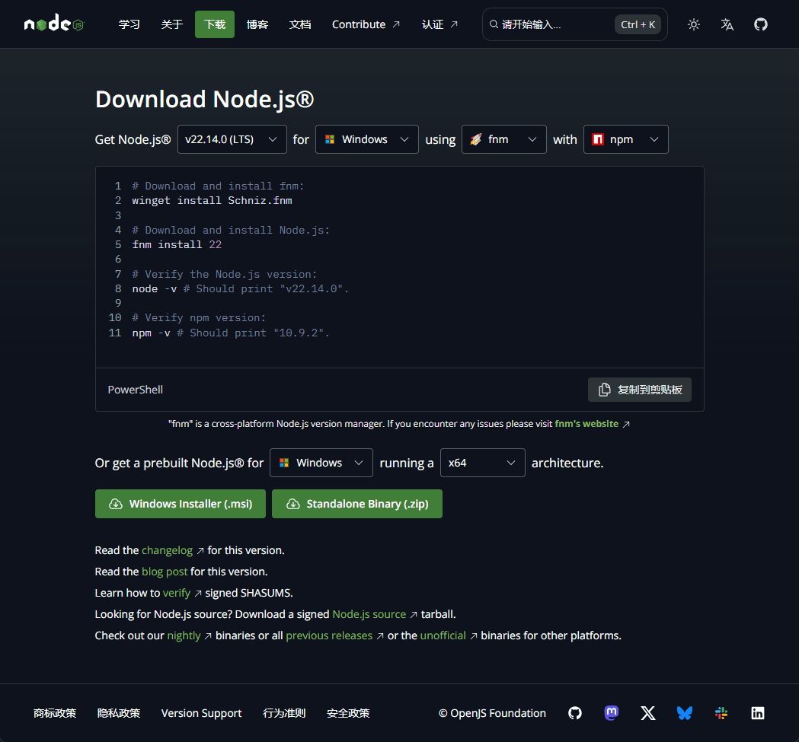

# 安装 Node.js

## 下载安装包

打开下载地址 [https://nodejs.org/zh-cn/download/](https://nodejs.org/zh-cn/download/)



可以看到有两种安装方式，**命令行**和**安装包**，这里我们选择下面的安装包进行安装。选择好操作系统和处理器架构后，点击 **Windows Installer** 下载。

如果不知道选择什么好，直接打开官网首页 [https://nodejs.org/zh-cn/](https://nodejs.org/zh-cn/) 点击 **下载 Node.js (LTS)** 即可。这个会帮我们选择好对应的版本。

## 安装

双击下载好的安装包，按照提示进行安装即可。

## 验证安装

打开命令行，输入以下命令：

```bash
node -v
```

出现版本号则表示安装成功。

## LTS 和 Current 版本

- LTS：长期支持版本，稳定，适合生产环境、开发环境
- Current：最新版本，功能齐全，具有一些新特新，但可能存在一些 bug，适合尝鲜和开发环境

## npm

npm 是 Node.js 的包管理工具，用于安装和管理 Node.js 的第三方库。

安装 Node.js 时会自动安装 npm，可以通过以下命令验证是否安装成功：

```bash
npm -v
```

除了 npm 外，还有两款常用的包管理工具：

- [yarn](https://yarnpkg.com/)：比 npm 更快，更稳定，更易用
- [pnpm](https://pnpm.io/zh/)：更节省磁盘空间，更快的安装速度，更少的磁盘 IO
