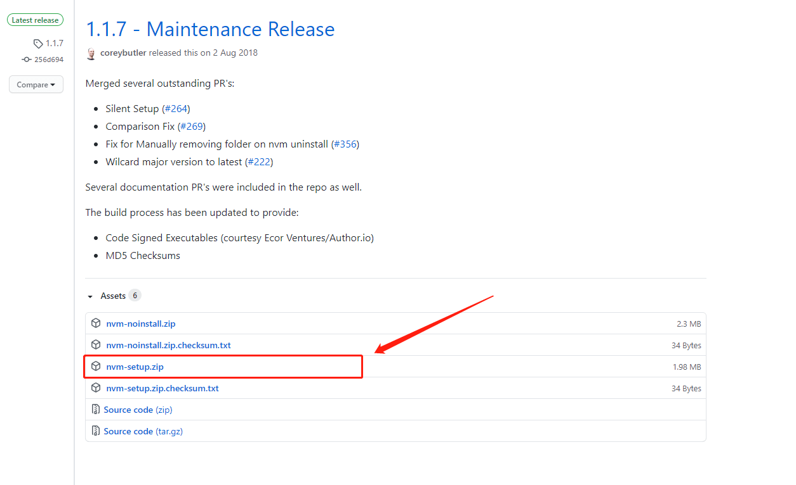
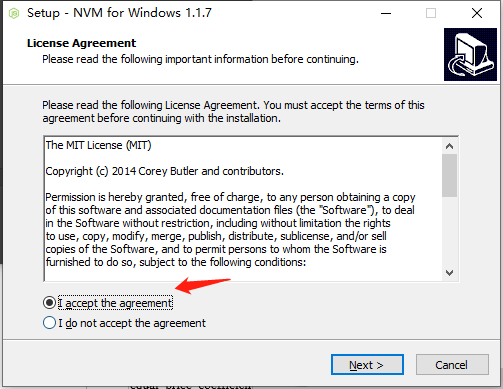
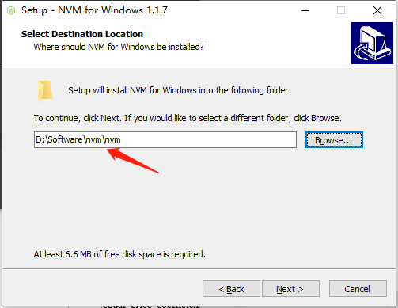
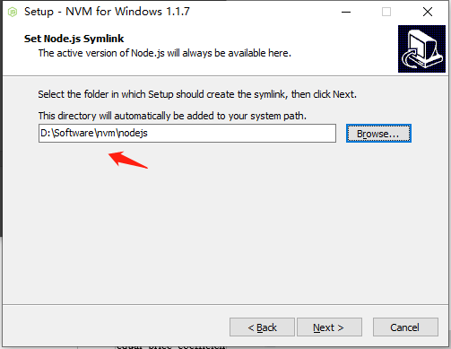
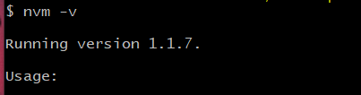
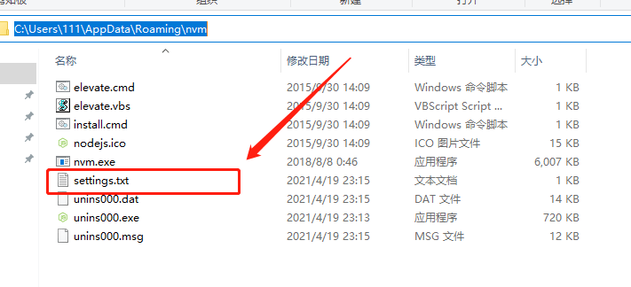
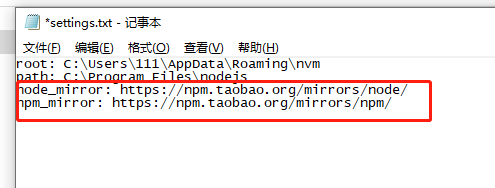
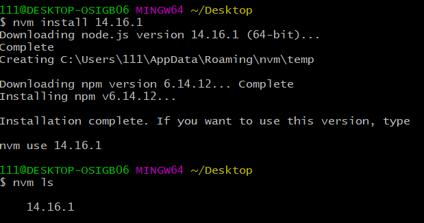
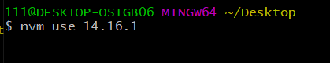
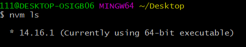

# NVM

在工作中，我们可能同时在进行多个不同的项目开发，每个项目的需求不同，进而不同项目必须依赖不同版本的 NodeJS 运行环境，这种情况下，对于维护多个版本的 node 将会是一件非常麻烦的事情，nvm 就是为解决这个问题而产生的，他可以方便的在同一台设备上进行多个 node 版本之间切换。

## 下载安装

### nvm 下载

安装包下载地址：https://github.com/coreybutler/nvm-windows/releases ，windows 系统下载 nvm-setup.zip 安装包。



### nvm 安装

如果电脑上之前已经单独安装了 node，先卸载，然后解压 nvm-setup.zip 安装包，进入解压的文件夹，双击 exe 后缀文件进行安装。



下面这个界面是选择安装 nvm 的路径，自己可以更改安装路径，一般默认路径。



下面这个是存放 nodejs 的位置。



安装完毕后输入 nvm -v 查看版本。看到版本就是安装成功了。



## 设置下载源

nvm 默认值时国外的下载源，下载速度较慢，设置为国内的下载源会快不少。

安装完毕后，找到安装的路径，一些简单配置，打开 **setting.txt**。

> 可以使用 `nvm root` 命令查看安装路径。



在后面添加下面两行。

```
node_mirror: https://npm.taobao.org/mirrors/node/
npm_mirror: https://npm.taobao.org/mirrors/npm/
```

如下



## nvm 的使用

```sh
nvm off                    # 禁用node.js版本管理(不卸载任何东西)
nvm on                     # 启用node.js版本管理
nvm install <version>      # 安装node.js的命名 version是版本号 例如：nvm install 8.12.0
nvm uninstall <version>    # 卸载node.js是的命令，卸载指定版本的nodejs，当安装失败时卸载使用
nvm current                # 显示node当前版本
nvm list installed         # 显示所有安装的node.js版本
nvm list                   # 同上
nvm ls                     # 同上
nvm list available         # 显示部分可以安装的所有node.js的版本(具体的可以看node官网)
nvm use <version>          # 切换到使用指定的nodejs版本
nvm version                # 显示nvm版本
nvm v                      # 同上
nvm -v                     # 同上
nvm install stable         # 安装最新稳定版
nvm alias <name> <version> # 给不同的版本号添加别名
nvm unalias <name>         # 删除已定义的别名
nvm reinstall-packages <version>  # 在当前版本node环境下，重新全局安装指定版本号的npm包
nvm proxy                  # 查看设置与代理
nvm node_mirror [url]      # 设置或者查看setting.txt中的node_mirror，如果不设置的默认是 https://nodejs.org/dist/
nvm npm_mirror [url]       # 设置或者查看setting.txt中的npm_mirror,如果不设置的话默认的是 https://github.com/npm/npm/archive/.
nvm use [version] [arch]   # 切换制定的node版本和位数
nvm root                   # 查看安装路径
```

见下图：



## 错误

1. 如果使用 node -v，提示 node:command not found，则需要 nvm use node 版本号，见下图

   

   下面显示当前使用的 node 版本是 14.16.1

   
