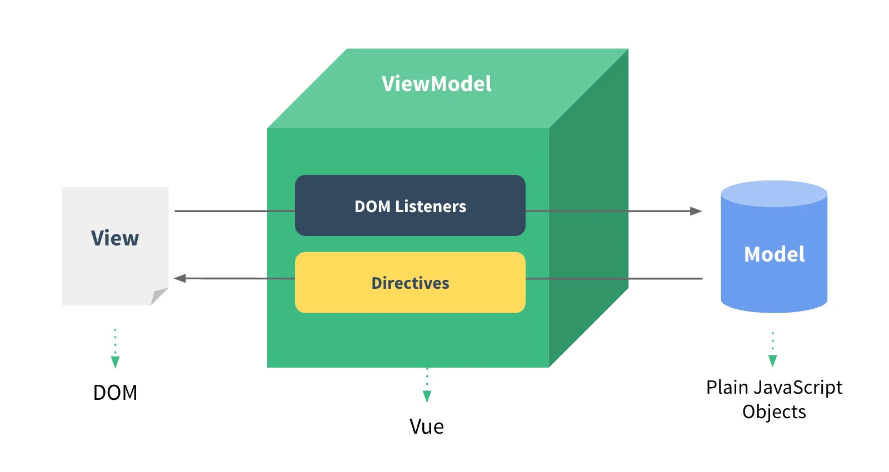

# Vue 核心

## 绑定 / 挂载容器

在 vue 中使用 el 属性绑定容器

绑定之后 vue 才能解析模版语法，以及各种操作

```html
<body>
	<script src="https://unpkg.com/vue@3/dist/vue.global.js"></script>
	<div id="app">
		<span>{{message}}</span>
	</div>
	<script>
		var app = new Vue({
			el: '#app', // 通过 el 属性绑定容器，使用 css 的id选择器'#'即可
			data: {
				message: 'Hello Vue!',
			},
		});
	</script>
</body>
```

### 第二种绑定/挂载语法（$mount）

优势：可以通过 js 语句动态控制绑定的容器

```html
<body>
	<script src="https://unpkg.com/vue@3/dist/vue.global.js"></script>
	<div id="app">
		<span>{{message}}</span>
	</div>
	<script>
		var app = new Vue({
			data: {
				message: 'Hello Vue!',
			},
		});
		// 通过 vue 实例的 $mount 函数绑定，传入一个字符串，字符串和 el 绑定语法一样
		app.$mount('#app');
	</script>
</body>
```

## data 配置项

1. 在 data 定义的数据，会做**数据代理**和**数据劫持**
2. 在 data 定义的数据，会通过**数据代理**到 vue 实例上，数据本质上是在 vue 实例上的 **\_data** 属性中
3. 在 \_data 数据，原则上不能使用它，可能会导致数据异常，比如监听属性失效、页面不会随数据的改变而改变，这就相当于绕过了数据代理，而 vue 很多功能的实现都是依赖于数据代理的

### data 的两种写法

1. 对象式：

    在非组件化编程时使用

    ```html
    <script>
    	var app = new Vue({
    		data: {
    			// 对象式
    			message: 'Hello Vue!',
    		},
    	});
    </script>
    ```

2. 函数式：

    在组件化编程时使用对象式，就会出现两个组件内有相同数据时，就会报错，而函数式就不会有这种问题

    注意：函数式不能使用箭头函数定义

    ```html
    <script>
    	var app = new Vue({
    		data() {
    			return {
    				// 函数式
    				message: 'Hello Vue!',
    			};
    		},
    	});
    </script>
    ```

## 模板语法

vue 采用模板语法来实现不同的功能

> vue 只会解析绑定容器内的模版语法

html 中包含了一些 JS 语法代码，语法分为两种，分别为：

### 插值语法

```html
<span>年龄：{{ age }}</span>
```

双大括号内的会作为 js 表达式解析，可以直接读取到 data 中的数据、methods 定义的方法和 props 传入的数据等

### 指令

以 **v-** 开头，用于解析标签属性、解析标签体内容、绑定事件等

```html
<a v-bind:href="url"></a>
```

`v-bind:href="xxx"` 同样 `xxx` 会作为 js 表达式解析，可以直接读取到 data 中的数据、methods 定义的方法和 props 传入的数据等

## 数据绑定

### 单向数据绑定

当数据发生变化时会自动更新在页面中用到的数据的地方

1. 语法：v-bind:href ="xxx" 或简写为 :href
2. 特点：数据只能从 data 流向页面

```html
<a v-bind:href="url"></a>
```

### 双向数据绑定

双向数据绑定不止数据改变页面更新，当页面的数据发生变化也会同步更新数据

1. 语法：v-mode:value="xxx" 或简写为 v-model="xxx"
2. 特点：数据不仅能从 data 流向页面，还能从页面流向 data

```html
<!-- 当 input 的内容变化时会同步更新数据 -->
<input v-model="value" />
```

## MVVM 模型

1. **M**：模型(Model) ：对应 data 中的数据

2. **V**：视图(View) ：模板

3. **VM**：视图模型(ViewModel) ： Vue 实例对象



在 VM (Vue 实例对象)中的两条线

1. Data Bindings：代表 vue 中 data 中那数据到页面展示
2. DOM Listeners：代表页面的数据变化时，同步更新 data 中的数据

## 数据代理

### 什么是数据代理

数据代理概念：通过一个对象代理对另一个对象中属性的操作（读/写）

```html
<script>
	let obj = { x: 100 };
	let obj2 = { y: 200 };

	Object.defineProperty(obj2, 'x', {
		// obj2 添加 x 属性，每次读/写 obj2 的 x 实际读/写的 obj 的 x，在这中间我们就可以做一些数据的操作比如的数据的监视、数据改变时可以做一些判断的是否可以改变
		get() {
			return obj.x;
		},
		set(value) {
			obj.x = value;
		},
	});
</script>
```

### Object.defineProperty

`Object.defineProperty(obj, prop, descriptor)` \[[mdn](https://developer.mozilla.org/zh-CN/docs/Web/JavaScript/Reference/Global_Objects/Object/defineProperty)\] 方法可以在一个对象上定义一个新属性，或者修改一个对象的现有属性， 并返回此对象

-   `obj`
    要定义属性的对象。

-   `prop`
    一个字符串或 Symbol，指定了要定义或修改的属性键。

-   `descriptor`
    要定义或修改的属性的描述符。

```html
<script>
	let number = 18
	let person = {
	    name:'张三',
	    sex:'男',
	}

	Object.defineProperty(person,'age',{ // 在对象 person 添加 age 属性
	    // value:18, // 添加属性的值
	    enumerable:true, // 控制属性是否可以枚举，默认值是false
	    writable:true, // 控制属性是否可以被修改，默认值是false
	    configurable:true // 控制属性是否可以被删除，默认值是false

	    //当有人读取person的age属性时，get函数(getter)就会被调用，且返回值就是age的值
	    get(){
	        console.log('有人读取age属性了')
	        return number // 返回的值就是 age 的值
	    },

	    //当有人修改person的age属性时，set函数(setter)就会被调用，且会收到修改的具体值
	    set(value){ // value 就是修改的具体值
	        console.log('有人修改了age属性，且值是', value)
	        number = value
	    }
	})

	console.log(person)
</script>
```

### Vue 中的数据代理

通过 vm 对象来代理 data 对象中属性的操作（读/写），实际就是将 data 中的数据代理到 vm 实例中

1. Vue 中数据代理的好处：
    1. 更加方便的操作 data 中的数据
2. 基本原理：
    1. 通过 Object.defineProperty() 把 data 对象中所有属性添加到 vm 上。
    2. 为每一个添加到 vm 上的属性，都指定一个 getter/setter。
    3. 在 getter/setter 内部去操作（读/写）data 中对应的属性。

## methods 方法

1. methods **是 vue 定义方法的地方**
2. methods 的里方法，都是被 vue 管理的，this 都是 vue 实例 或 组件实例化对象
3. methods 的里方法都会挂载到 vue 实例上，可以通过 vm.方法名调用，也可以在方法里通过 this 调用另一个方法
4. 注意：不能使用箭头函数，会导致 this 指向错误

```js
const vm = new Vue({
	el: '#root',
	methods: {
		func: function () {
			// 完整写法
			console.log('func方法被调用');
			// 方法内的 this 就是 vue 实例
			// console.log(this)
		},
		func2() {
			// 简写形式
			console.log('func2方法被调用');
		},
		func3: () => {
			// 不能使用箭头函数
			console.log('func3方法被调用');
			// 箭头函数方法内的 this 是 window
			// console.log(this)
		},
	},
});
```

## 事件处理

### 事件绑定

vue 的事件绑定的方式与原生的方式不太一样，是通过 **v-on** 指令来实现的，事件的回调函数需要写在 **methods** 配置项中

1. 写法：写在元素内部 `v-on:事件名="回调函数(参数 1, 参数 2, ……)"`
2. 回调函数在没有传参时，会自动传入一个 event
3. 回调函数在有传参时，可以使用 $event 传递 event

```html
<body>
	<script src="https://unpkg.com/vue@3/dist/vue.global.js"></script>
	<div id="app">
		<!-- 写法：v-on:事件名="回调函数(参数1, 参数2, ……)" -->
		<button v-on:click="func()">按钮1</button>
		<!-- 简写形式 -->
		<button @click="func">按钮2</button>
		<!-- 传递参数 -->
		<button @click="func(1)">按钮3</button>
		<!-- 传递参数，同时传递 event ，使用 $event 占位 vue 就会自动吧 $event 替换成事件对象 event -->
		<button @click="func(1, $event)">按钮4</button>
	</div>
	<script>
		var app = new Vue({
			el: '#app',
			methods: {
				func(a, b) {
					console.log('按钮被点击');
					if (a) console.log('传递一个参数：', a);
					if (b) console.log('事件对象：', b);
				},
			},
		});
	</script>
</body>
```

### 事件修饰符

Vue 中的事件修饰符：

1. `prevent`：阻止默认事件（常用）
2. `stop`：阻止事件冒泡（常用）
3. `once`：事件只触发一次（常用）
4. `capture`：使用事件的捕获模式
5. `self`：只有 event.target 是当前操作的元素时才触发事件
6. `passive`：事件的默认行为立即执行，无需等待事件回调执行完毕

只需要在事件名后面的加上 **对应的修饰符** 就可以实现不同效果

```vue
<div @click.once="onclick"></div>
```

### 键盘事件

vue 有两种键盘事件 `keyup`(按下再松开时触发) 和 `keydown`(按下触发，按下不松会多次触发)

#### 按键别名

1. `enter`: 回车
2. `delete`: 删除 (捕获“删除”和“退格”键)
3. `esc`： 退出
4. `space`： 空格
5. `tab`： 换行(特殊，必须配合 keydown 去使用)
6. `up`： 上
7. `down`： 下
8. `left`： 左
9. `right`： 右

```vue
<!-- 按下回车触发 -->
<div @keyup.enter="callback"></div>
```

Vue 未提供别名的按键，可以使用按键原始的 key 值（key 值可以通过 event.key 来获取）去绑定，但注意按键名为多个单词组成时，要转为 kebab-case（全部小写，短横线连接单词）

##### 按键码

::: warning 注意
  keyCode 的事件用法已经被废弃了并可能不会被最新的浏览器支持
:::

使用 keyCode attribute 也是允许的：

```html
<input v-on:keyup.13="submit" />
```

#### 系统修饰键

1. `ctrl`
2. `alt`
3. `shift`
4. `meta`: 在 Mac 上对应 command 键，在 Windows 上对应 win 键

```vue
<!-- Alt + C -->
<input v-on:keyup.alt.67="clear" />

<!-- Ctrl + Click -->
<div v-on:click.ctrl="doSomething">Do something</div>
```

##### `.exact` 修饰符

.exact 修饰符允许你控制由精确的系统修饰符组合触发的事件。

```html
<!-- 即使 Alt 或 Shift 被一同按下时也会触发 -->
<button v-on:click.ctrl="onClick">A</button>

<!-- 有且只有 Ctrl 被按下的时候才触发 -->
<button v-on:click.ctrl.exact="onCtrlClick">A</button>

<!-- 没有任何系统修饰符被按下的时候才触发 -->
<button v-on:click.exact="onClick">A</button>
```

##### 鼠标按钮修饰符

-   `.left`
-   `.right`
-   `.middle`

这些修饰符会限制处理函数仅响应特定的鼠标按钮。

## computed 计算属性

当需要的数据，需要经过计算后才能得到时，可以使用计算属性。

-   与 `methods` 实现相比，内部有缓存机制（复用），效率更高，调试方便。

-   当使用的数据变化时自动更新

计算属性最终会出现在 vm 上，直接读取使用即可

```html
<div id="root">
	<h2>{{fullName}}</h2>
	<h2>{{fullName2}}</h2>
</div>
```

```js
const vm = new Vue({
    el:'#root',
    data:{
        firstName:'张',
        lastName:'三',
    },
    computed:{
        fullName:{
            // get有什么作用？当有人读取fullName时，get就会被调用，且返回值就作为fullName的值
            // get什么时候调用？1.初次读取fullName时。2.所依赖的数据发生变化时。
            get(){
                console.log('get被调用了')
                // console.log(this) //此处的this是vm
                return this.firstName + '-' + this.lastName
            },
            // set什么时候调用? 当fullName被修改时。
            set(value){
                console.log('set被调用了',value)
                const arr = value.split('-')
                this.firstName = arr[0]
                this.lastName = arr[1]
            }
        }
        // 简写(简写仅支持get)
        fullName2(){
            console.log('get被调用了')
        	return this.firstName + '-' + this.lastName
        }
    }
})
```

## watch 监视 / 侦听器

数据变化时执行回应回调，回调接受两个值(改变后的值，改变前的值)

配置的属性名，需要和 data 中的数据一一对应

当数据变化时，需要做某些操作，但操作需要在数据变化后才执行，可以使用 `watch`

函数式：

```js
const vm = new Vue({
	el: '#root',
	data: {
		num: 1,
	},
	watch: {
    // 对应 data 中的 num 属性
		num(newval, oldval) {
			console.log('新值', newval);
			console.log('旧值', oldval);
		},
	},
});
```

对象式

```js
const vm = new Vue({
	el: '#root',
	data: {
		obj: {
			a: 1,
			b: {
				c: 1,
				d: 2,
			},
		},
	},
	watch: {
		obj: {
			handler(newval, oldval) {
				console.log('新值', newval);
				console.log('旧值', oldval);
			},
			immediate: true, // 初始化调用
			deep: true, // 深度监视
		},
	},
});
```

## class 与 style 绑定

操作元素的 class 列表和内联样式是数据绑定的一个常见需求。因为它们都是 attribute(属性)，所以我们可以用 `v-bind` 处理它们：只需要通过表达式计算出字符串结果即可。不过，字符串拼接麻烦且易错。因此，在将 `v-bind` 用于 `class` 和 `style` 时，Vue.js 做了专门的增强。表达式结果的类型除了字符串之外，还可以是对象或数组。

```html
<div v-bind:class="{ active: isActive }"></div>
```
上面的语法表示 `active` 这个 class 存在与否将取决于 `isActive` 的布尔判定是否为真值([Truthy](https://developer.mozilla.org/zh-CN/docs/Glossary/Truthy))
