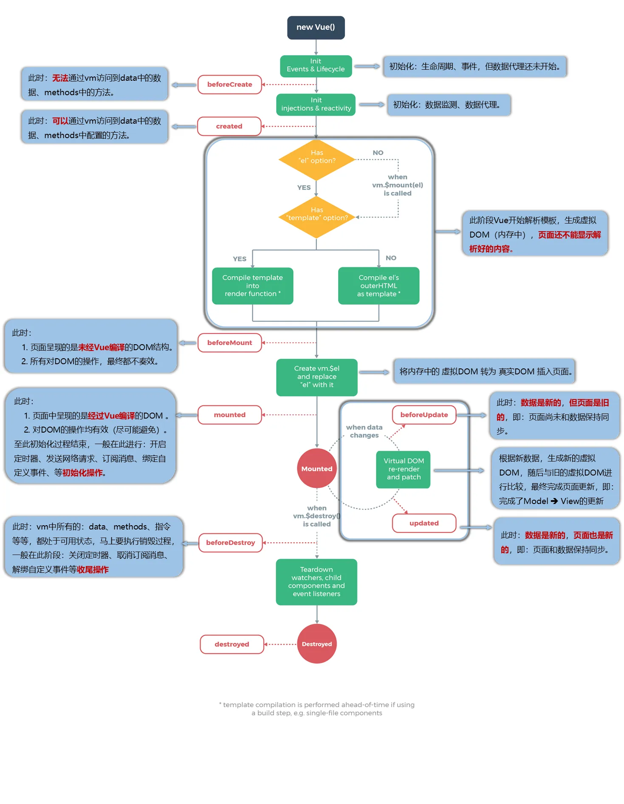

# 生命周期

Vue 实例有一个完整的生命周期，从创建到销毁会经历一系列的过程。在这一过程中，Vue 提供了多个生命周期钩子函数，允许我们在特定阶段执行自定义逻辑。

## 生命周期钩子总览

Vue2 实例在被创建和销毁的过程中，会自动调用一系列的生命周期钩子函数。这些钩子函数包括：

- `beforeCreate` - 创建前
- `created` - 创建后
- `beforeMount` - 挂载前
- `mounted` - 挂载后
- `beforeUpdate` - 更新前
- `updated` - 更新后
- `beforeDestroy` - 销毁前
- `destroyed` - 销毁后

下面是 Vue2 生命周期的图示：



## 各生命周期钩子详解

### beforeCreate（创建前）

在实例初始化之后，数据观测 (data observer) 和 event/watcher 事件配置之前被调用。

**特点：**
- 此时实例还未完全初始化
- 无法访问 data、methods、computed 等选项
- 通常在此阶段进行一些插件的初始化工作

**应用场景：**
- 插件的初始化
- 一些与 Vue 实例无关的早期设置

```js
new Vue({
  beforeCreate() {
    console.log('beforeCreate 钩子被调用');
    // 在这里访问 data 会报错
    // console.log(this.message); // undefined
  }
});
```

### created（创建后）

在实例创建完成后被立即调用。在这一步，实例已完成以下的配置：数据观测 (data observer)，属性和方法的运算，watch/event 事件回调。然而，挂载阶段还没开始，$el 属性目前尚不可见。

**特点：**
- 实例已完成数据观测和事件配置
- 可以访问 data、methods、computed 等选项
- $el 属性还不可用
- DOM 还未生成

**应用场景：**
- 进行数据初始化
- 发起 AJAX 请求获取数据
- 设置定时器等早期逻辑

```js
new Vue({
  data: {
    message: 'Hello Vue!'
  },
  created() {
    console.log('created 钩子被调用');
    console.log(this.message); // 可以访问数据
    // 发起 AJAX 请求
    // this.fetchData();
  }
});
```

### beforeMount（挂载前）

在挂载开始之前被调用：相关的 render 函数首次被调用。

**特点：**
- 模板编译完成，但尚未渲染到页面
- $el 已经被创建，但虚拟 DOM 还未挂载到页面上
- 在服务端渲染期间不被调用

**应用场景：**
- 修改将要挂载的 DOM 元素
- 在渲染前对数据进行最后的修改

```js
new Vue({
  beforeMount() {
    console.log('beforeMount 钩子被调用');
    // 此时可以访问 $el，但页面上还看不到
    // console.log(this.$el.textContent);
  }
});
```

### mounted（挂载后）

实例被挂载后调用，这时 el 被新创建的 vm.$el 替换。如果根实例挂载到了一个文档内的元素上，当 mounted 被调用时 vm.$el 也在文档内。

**特点：**
- DOM 已经生成并挂载到页面上
- 可以访问 DOM 元素
- 可以进行 DOM 操作
- 在服务端渲染期间不被调用

**应用场景：**
- DOM 操作
- 发起依赖 DOM 的操作（如图表初始化）
- 启动定时器
- 添加事件监听器
- 发起 AJAX 请求

```js
new Vue({
  mounted() {
    console.log('mounted 钩子被调用');
    // 可以访问 DOM 元素
    console.log(this.$el);
    // 初始化第三方插件
    // this.initChart();
    // 添加事件监听器
    // window.addEventListener('resize', this.handleResize);
  }
});
```

### beforeUpdate（更新前）

数据更新时调用，发生在虚拟 DOM 重新渲染和打补丁之前。你可以在这个钩子中进一步地更改状态，这不会触发附加的重渲染过程。

**特点：**
- 数据已经更新，但 DOM 还未重新渲染
- 适合在更新之前访问现有的 DOM 状态
- 在服务端渲染期间不被调用

**应用场景：**
- 在更新前获取 DOM 状态
- 根据状态变化执行特定逻辑

```js
new Vue({
  beforeUpdate() {
    console.log('beforeUpdate 钩子被调用');
    // 可以访问更新前的 DOM 状态
    // const oldValue = this.$refs.input.value;
  }
});
```

### updated（更新后）

由于数据更改导致的虚拟 DOM 重新渲染和打补丁，在这之后会调用该钩子。

**特点：**
- DOM 已经完成重新渲染和更新
- 避免在此期间更改状态，可能会导致无限循环更新
- 在服务端渲染期间不被调用

**应用场景：**
- DOM 更新后的操作
- 依赖 DOM 更新的操作（如重新计算元素尺寸）

```js
new Vue({
  updated() {
    console.log('updated 钩子被调用');
    // DOM 已经更新完成
    // 可以执行依赖 DOM 的操作
    // this.calculateElementSize();
  }
});
```

### beforeDestroy（销毁前）

实例销毁之前调用。在这一步，实例仍然完全可用。

**特点：**
- 实例仍然完全可用
- 可以访问所有属性和方法
- 在服务端渲染期间不被调用

**应用场景：**
- 清理定时器
- 取消网络请求
- 解绑事件监听器
- 清理资源（如 WebSocket 连接）

```js
new Vue({
  beforeDestroy() {
    console.log('beforeDestroy 钩子被调用');
    // 清理工作
    // clearInterval(this.timer);
    // this.websocket.close();
  }
});
```

### destroyed（销毁后）

Vue 实例销毁后调用。调用后，Vue 实例指示的所有东西都会解绑定，所有的事件监听器会被移除，所有的子实例也会被销毁。

**特点：**
- 所有事件监听器已被移除
- 所有子实例已被销毁
- 实例的所有指令都被解绑

**应用场景：**
- 最后的清理工作
- 通知或日志记录

```js
new Vue({
  destroyed() {
    console.log('destroyed 钩子被调用');
    // 最后的清理工作
    // 发送统计数据
  }
});
```

## 使用建议

1. **合理选择钩子函数**：根据需求选择合适的生命周期钩子，避免在不合适的阶段执行操作。
2. **避免在 updated 中修改数据**：这可能导致无限循环更新。
3. **及时清理资源**：在 beforeDestroy 或 destroyed 中清理定时器、事件监听器等资源。
4. **服务端渲染注意事项**：beforeMount、mounted、beforeUpdate、updated、beforeDestroy 和 destroyed 在服务端渲染期间不会被调用。
5. **异步操作处理**：在组件销毁前确保取消未完成的网络请求或异步操作，避免内存泄漏。

通过合理使用这些生命周期钩子，我们可以更好地控制 Vue 应用的行为，优化性能并避免常见的陷阱。

## 相关链接

- [Vue 生命周期钩子](https://v2.cn.vuejs.org/v2/guide/instance.html#%E5%AE%9E%E4%BE%8B%E7%94%9F%E5%91%BD%E5%91%A8%E6%9C%9F%E9%92%A9%E5%AD%90)
