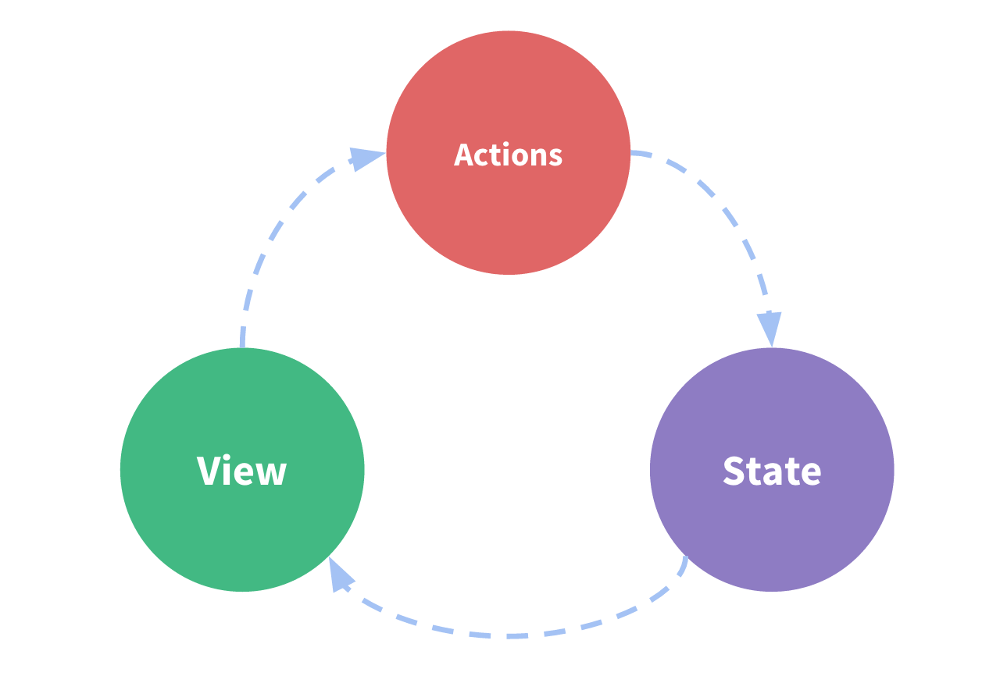

# Vuex 状态管理

Vuex 是一个专为 Vue.js 应用程序开发的状态管理模式 + 库。它采用集中式存储管理应用的所有组件的状态，并以相应的规则保证状态以一种可预测的方式发生变化。

简单来说，Vuex 就像是一个全局的"数据仓库"，所有组件都可以访问和修改其中的数据。它解决了多个组件之间共享状态的问题，使得状态管理更加清晰和高效。

## 核心概念

Vuex 的核心概念在不同版本中保持一致：

1. **State** - 存储应用状态
2. **Getters** - 从 state 派生出一些状态
3. **Mutations** - 修改 state 的唯一方式（同步）
4. **Actions** - 处理异步操作
5. **Modules** - 模块化管理

## 核心原理

Vuex 的工作流程遵循一个单向数据流的原则，其核心流程如下：



1. **Vue Components（Vue 组件）**：负责接收用户操作，执行 dispatch 方法触发对应 action 进行回应。
2. **Actions（操作）**：处理操作行为的模块，包含同步/异步操作，支持多个同名方法。向后台 API 请求和触发其他 action 都在这里进行。
3. **Mutations（变更）**：状态改变的操作方法，是 Vuex 修改 state 的唯一推荐方法。只能进行同步操作，方法名全局唯一。
4. **State（状态）**：页面状态管理容器对象，集中存储 Vue Components 中 data 对象的零散数据，以进行统一的状态管理。

整个流程可以概括为：组件 -> Actions（处理异步）-> Mutations（改状态）-> State（更新）-> 组件（重新渲染）


## 版本选择

- Vue 2.x 需要使用 Vuex 3.x 版本
  ::: code-group

  ```sh [npm]
  npm install vuex@3
  ```

  ```sh [pnpm]
  pnpm add vuex@3
  ```

  ```sh [yarn]
  yarn add vuex@3
  ```

  :::
- Vue 3.x 需要使用 Vuex 4.x 版本
  ::: code-group
  
  ```sh [npm]
  npm install vue@4
  ```
  
  ```sh [pnpm]
  pnpm add vue@4
  ```
  
  ```sh [yarn]
  yarn add vue@4
  ```
  
  :::

## 项目结构

```
├── index.html
├── main.js
├── api
│   └── ... # 抽取出API请求
├── components
│   ├── App.vue
│   └── ...
└── store
    ├── index.js          # 我们组装模块并导出 store 的地方
    ├── actions.js        # 根级别的 action
    ├── mutations.js      # 根级别的 mutation
    └── modules
        ├── cart.js       # 购物车模块
        └── products.js   # 产品模块
```

## 相关链接

- [Vuex 3 官方文档](https://v3.vuex.vuejs.org/zh/)
- [Vuex 4 官方文档](https://vuex.vuejs.org/zh/)
- [Vue 2 官方文档](https://v2.cn.vuejs.org/)
- [Vue 3 官方文档](https://cn.vuejs.org/)
